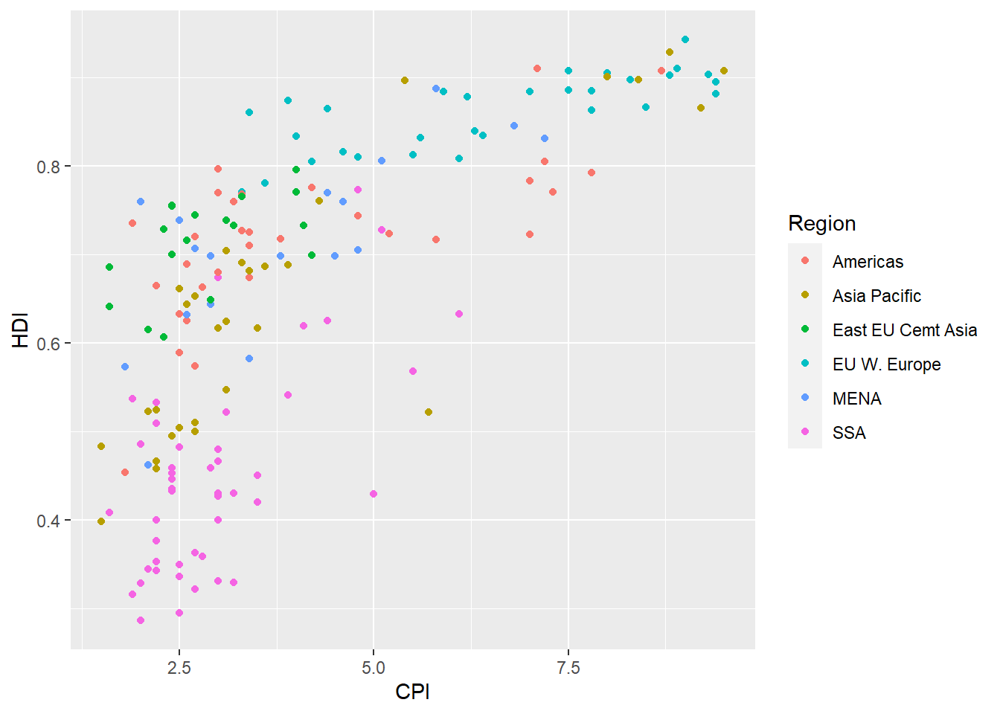
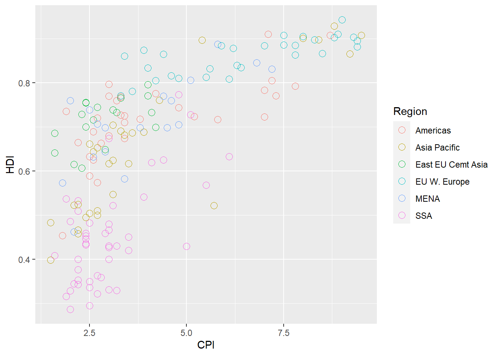
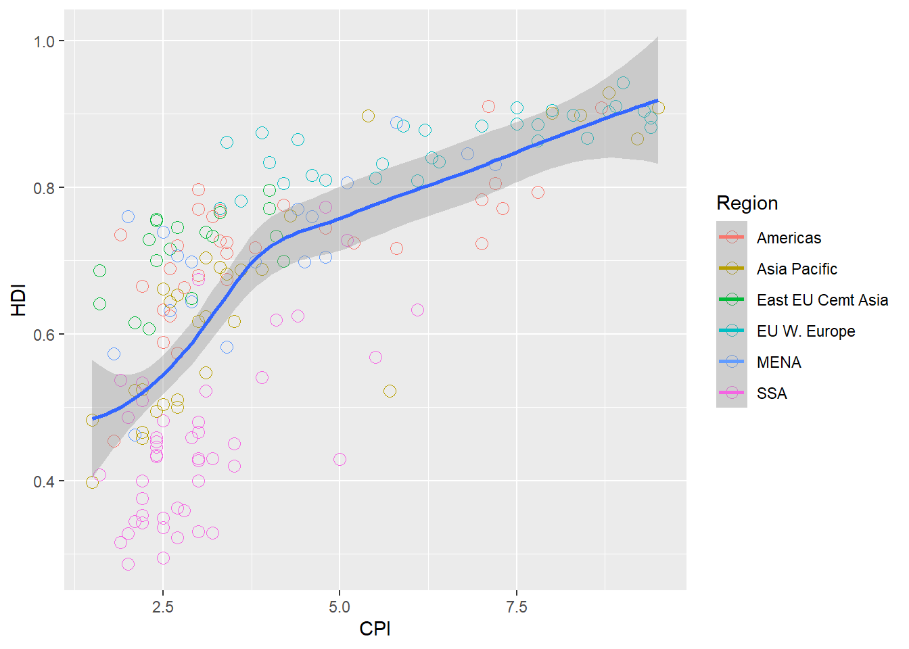
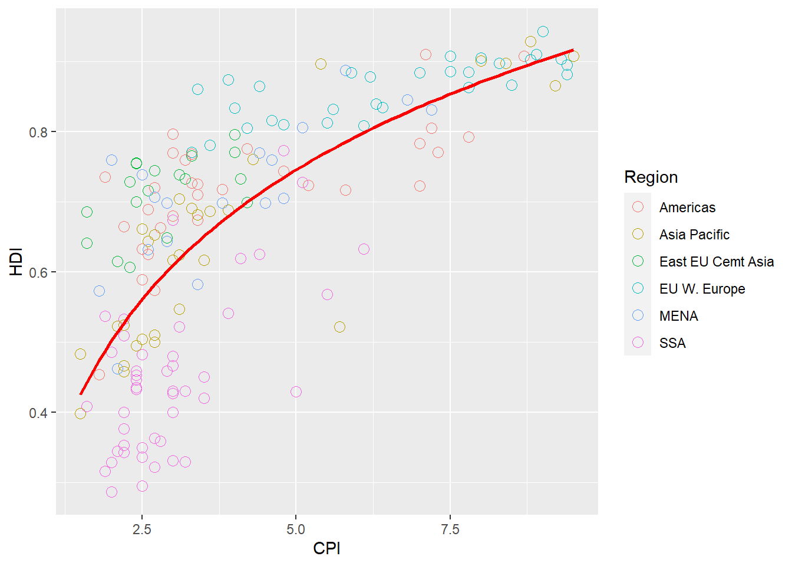
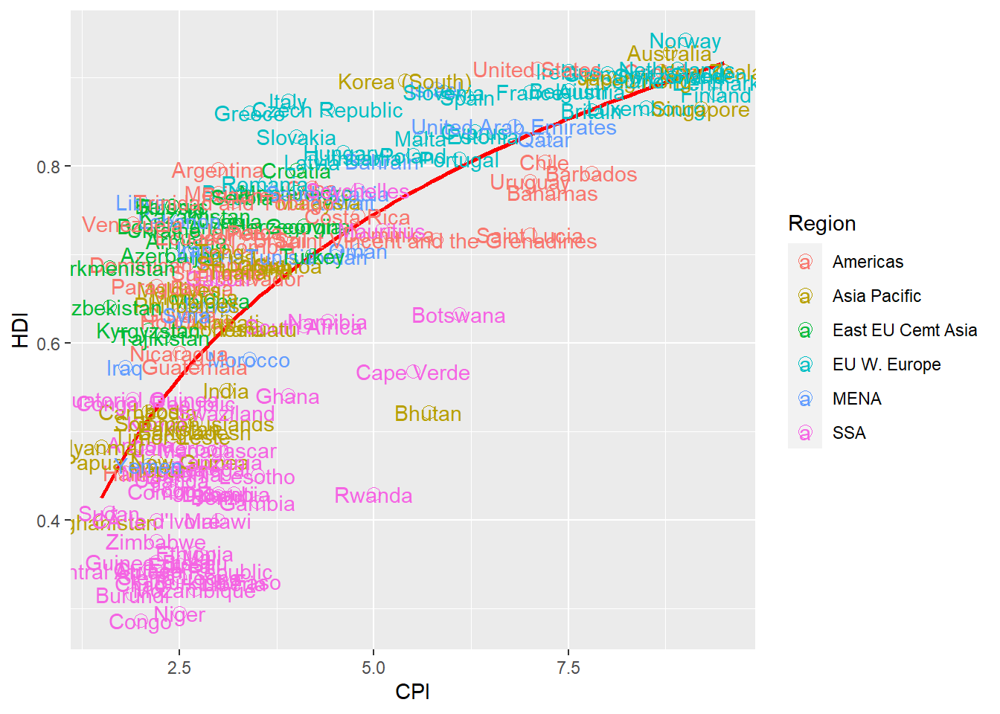
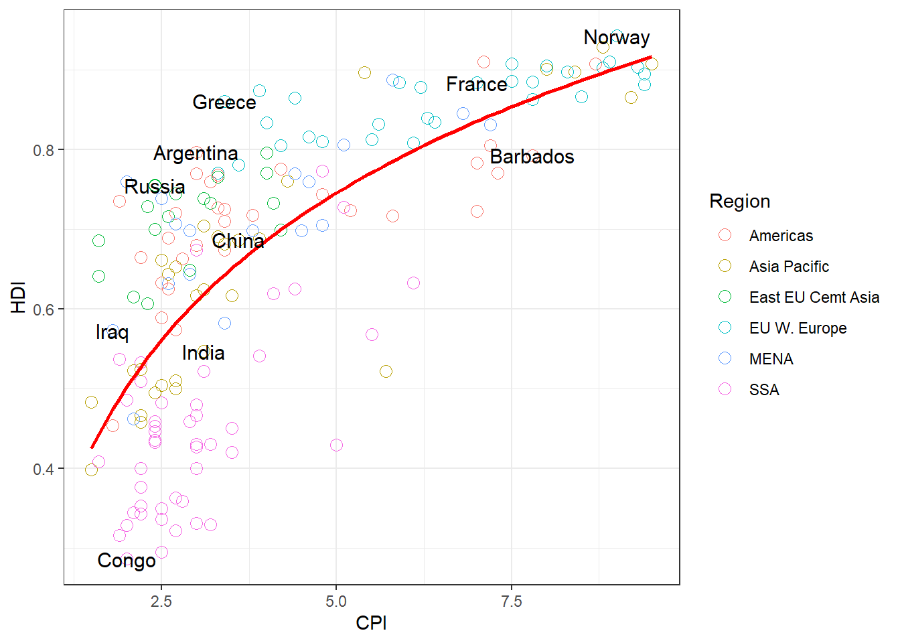
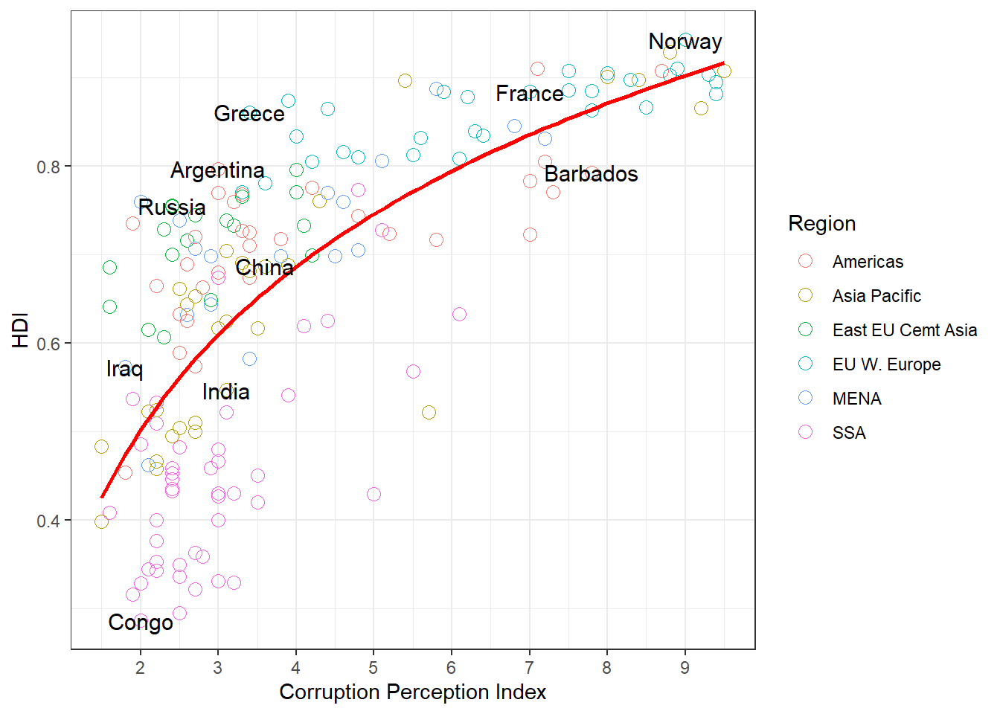
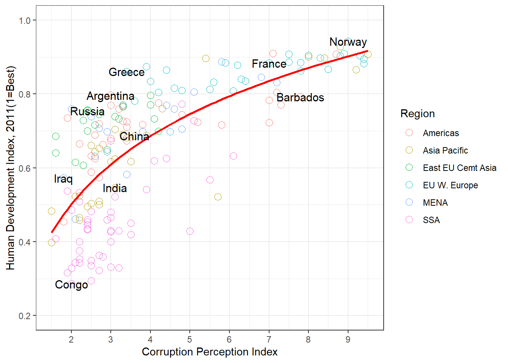
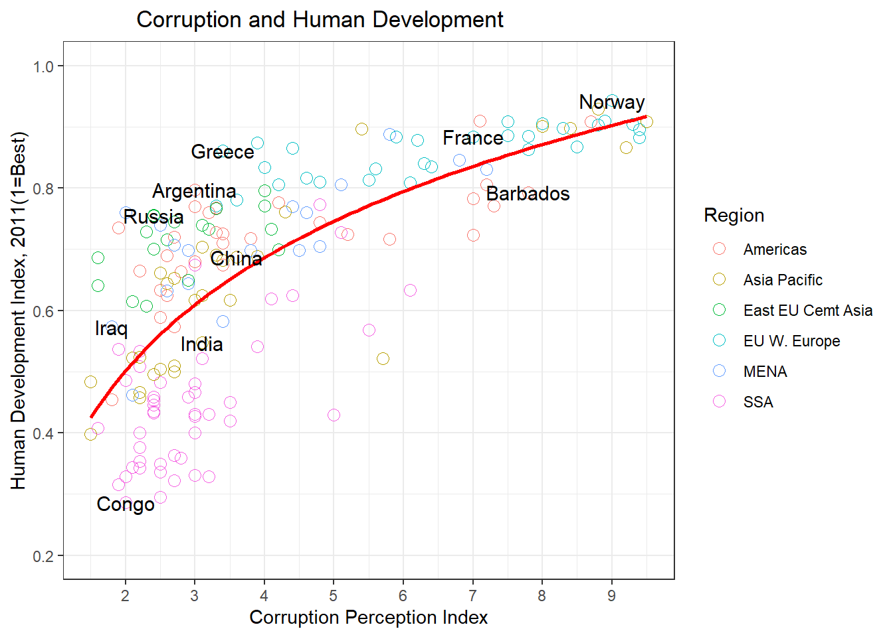

``` r
knitr::opts_chunk$set(fig.path='Figs/')
```

Exercise 5. Case study using GGPLOT
===================================

<br>

<b>Estimated time: </b>  
150 Minutes

<b>What this exercise is about</b>  
For this optional assignment we will be recreating this plot from The
Economist: Feel free to work through as little Or as much as you want.  
<br> This assignrnent Will be very challenging! You Will recreate this
plot by following the Steps outlined in bold below. You Will need to
reference documentation! There are things in this plot that we have
purposefully not covered to test your skills in going to the
documentation and referencing what you need to know. Links and hints
will provided to along way!.

<b><br> Requirernents:</b> RStudio and GGPLOT

``` r
library(ggplot2)
library(dplyr)
```

    ## 
    ## Attaching package: 'dplyr'

    ## The following objects are masked from 'package:stats':
    ## 
    ##     filter, lag

    ## The following objects are masked from 'package:base':
    ## 
    ##     intersect, setdiff, setequal, union

<br> <b>  
Solve the following problerns using R </b>

Import the ggplot2 data.table libraries and use fread to load the csv
file ‘Economist\_Assignment\_Data.csv’ into a dataframe called df ?

``` r
df <- read.csv("datasets/Economist_Assignment_Data.csv")[-1]
```

<br> Check the head of df?

``` r
head(df)
```

    ##       Country HDI.Rank   HDI CPI            Region
    ## 1 Afghanistan      172 0.398 1.5      Asia Pacific
    ## 2     Albania       70 0.739 3.1 East EU Cemt Asia
    ## 3     Algeria       96 0.698 2.9              MENA
    ## 4      Angola      148 0.486 2.0               SSA
    ## 5   Argentina       45 0.797 3.0          Americas
    ## 6     Armenia       86 0.716 2.6 East EU Cemt Asia

<br> Use ggplot() + geom\_plot() to create a scatter plot object called
pl. You Will need to specify x=CPl and y=HDI and color=Region as
aesthetics

``` r
ggplot(data = df,mapping =aes(x = CPI,y = HDI,color= Region)) + 
     geom_point()
```

 <br>

Change the points to be larger empty circles. (You’ll have to go back
and add arguments to geom\_point() and reassign it to Pl.) You’ll need
to figure out what shape = and size =

``` r
ggplot(data = df,mapping =aes(x = CPI,y = HDI,color= Region)) + 
     geom_point(shape = 1, size=3)
```

 <br> Add geom\_smooth(aes(group=1)) to
add a trend line

``` r
ggplot(data = df,mapping =aes(x = CPI,y = HDI,color= Region)) + 
     geom_point(shape = 1, size=3) +
     geom_smooth(aes(group=1))
```

    ## `geom_smooth()` using method = 'loess' and formula 'y ~ x'

 <br> We want to further edit this trend
line. Add the following arguments to geom\_smooth (outside of aes):

-   method = ‘lm’
-   formula = y log(x)
-   se = FALSE
-   color = red

``` r
ggplot(data = df,mapping =aes(x = CPI,y = HDI,color= Region)) + 
     geom_point(shape = 1, size=3) +    
     geom_smooth(aes(group=1), color ="red", method = "lm",se=F, formula = y~log(x))
```

 <br> It’s really starting to look
similar! But we still need to add labels, we can use geom text! Add
geom\_text(aes(label = Country)) and see what happens (Hint: It should
be way too many labels)

``` r
ggplot(data = df,mapping =aes(x = CPI,y = HDI,color= Region)) + 
     geom_point(shape = 1, size=3) +
     geom_smooth(aes(group=1), color ="red", method = "lm",se=F, formula = y~log(x)) +
     geom_text(aes(label=Country))
```

 <br> Label the subset of the plot

``` r
ggplot(data = df,mapping =aes(x = CPI,y = HDI,color= Region)) + 
     geom_point(shape = 1, size=3) +
     geom_smooth(aes(group=1), color ="red", method = "lm",se=F, formula = y~log(x)) +
     geom_text(data = filter(df,Country 
     %in%   c("Congo","India","Greece","Russia","Iraq","China","Norway","France","Argentina","Barbados")),
     aes(label =Country),size = 4,color= "black")
```

 <br> Almost there! Still not perfect,
but good enough for this assignment. Later on we’ll see why interactive
plots are better for labeling. Now let’s just add some labels and a
theme, set the x and y scales and we’re done!  
Add theme\_bw() to your plot

``` r
ggplot(data = df,mapping =aes(x = CPI,y = HDI,color= Region)) + geom_point(shape = 1, size=3) +
     geom_smooth(aes(group=1), color ="red", method = "lm",se=F, formula = y~log(x)) +
     geom_text(data = filter(df,Country 
     %in% c("Congo","India","Greece","Russia","Iraq","China","Norway","France","Argentina","Barbados")),
     aes(label =Country),size = 4,color= "black") +
     theme_bw()
```

 <br> Add scale\_x\_continuous0 and set
the following arguments:

-   name = Same x axis as the Economist Plot
-   limits = Pass a vector of agpropriate x limits
-   breaks = 1:10

``` r
ggplot(data = df,mapping =aes(x = CPI,y = HDI,color= Region)) + geom_point(shape = 1, size=3) +
     geom_smooth(aes(group=1), color ="red", method = "lm",se=F, formula = y~log(x)) +
     geom_text(data = filter(df,Country 
     %in% c("Congo","India","Greece","Russia","Iraq","China","Norway","France","Argentina","Barbados")),            
     aes(label =Country),size = 4,color= "black") +
     theme_bw() + 
     scale_x_continuous(name = "Corruption Perception Index",breaks = 1:10)
```

 <br> Now use scale\_y\_continuous() to
do similar operations to the y axis!

``` r
ggplot(data = df,mapping =aes(x = CPI,y = HDI,color= Region)) + geom_point(shape = 1, size=3) +
     geom_smooth(aes(group=1), color ="red", method = "lm",se=F, formula = y~log(x)) +
     geom_text(data = filter(df,Country 
     %in% c("Congo","India","Greece","Russia","Iraq","China","Norway","France","Argentina","Barbados")),            
     aes(label =Country),size = 4,color= "black") +
     theme_bw() + 
     scale_x_continuous(name = "Corruption Perception Index",breaks = 1:10) +
     scale_y_continuous(name = "Human Development Index, 2011(1=Best)",limits = c(.2,1))
```

 <br> finally use ggtitle() to add a
sring as a title

``` r
ggplot(data = df,mapping =aes(x = CPI,y = HDI,color= Region)) + geom_point(shape = 1, size=3) +
     geom_smooth(aes(group=1), color ="red", method = "lm",se=F, formula = y~log(x)) +
     geom_text(data = filter(df,Country 
     %in% c("Congo","India","Greece","Russia","Iraq","China","Norway","France","Argentina","Barbados")),            
     aes(label =Country),size = 4,color= "black") +
     theme_bw() + 
     scale_x_continuous(name = "Corruption Perception Index",breaks = 1:10) +
     scale_y_continuous(name = "Human Development Index, 2011(1=Best)",limits = c(.2,1)) +
     ggtitle(label = "           Corruption and Human Development")
```

 <br>
